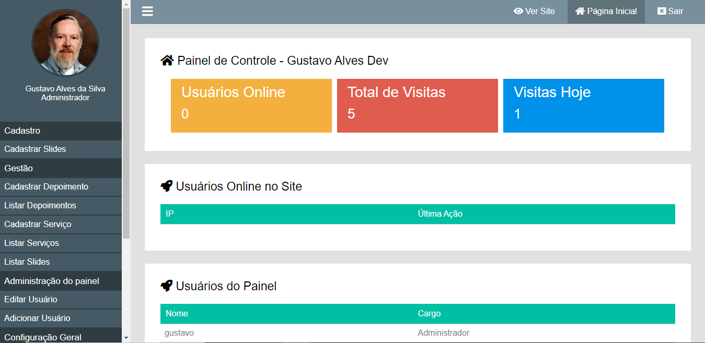
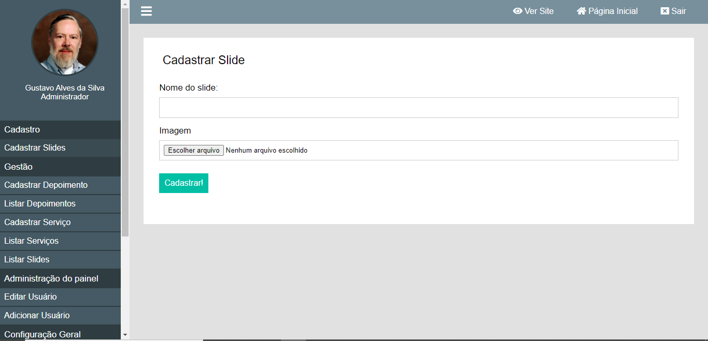
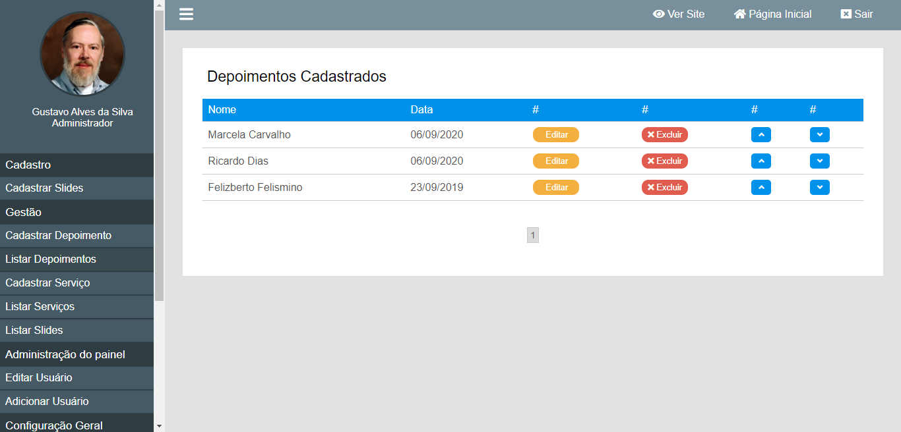
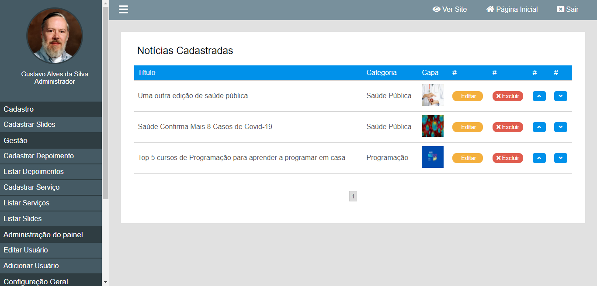

# Site em PHP com Painel Administrativo
Site com painel administrativo, escrito em PHP com banco de dados MySQL. Algumas funcionalidades presentes no painel:
  
  - Depoimentos
  - Serviços
  - Gestão de Usuários
  - Configurações de Usuários, Funcionalidades e do Site em Geral
  - Notícias / Blog

## Template
Este projeto usa o template Beemind, também desenvolvido por mim, <b>Gustavo Alves Dev</b>, e pode ser encontrado no seguinte repositório: <a href="https://github.com/gustavoalvesdev/template-beemind" target="_blank">Template Beemind</a>






## Como Instalar

### Clone

Para clonar o repositório:
```shell
$ git clone https://github.com/gustavoalvesdev/php-admin-panel-website.git
```
No diretório raiz há um arquivo chamado "projeto_01.sql" que contém o dump do banco de dados do projeto. Use este arquivo para criar o banco de dados em seu servidor.

Edite o arquivo "config.php" no diretório raiz, com as informações de conexão com o banco de dados e o PATH para o projeto no seu servidor
